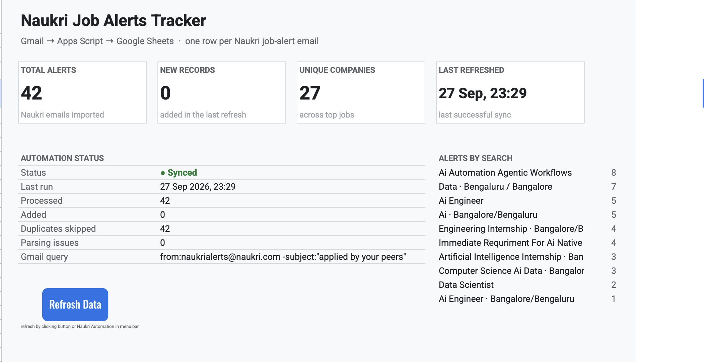

# Naukri Job Alerts Tracker

This Google Apps Script project collects Naukri job-alert emails from Gmail and tracks them in a Google Sheet.

**Spreadsheet:** [Open the tracker](https://docs.google.com/spreadsheets/d/1GtOCppYwQyGQNjqpOzRFXfukS-BODf-EoB6lyTZbWzo/edit?usp=sharing)

## How it works

- Searches Gmail for Naukri job alerts and skips peer-activity emails.
- Reads each email's HTML to find its job cards and details.
- Picks a top job using this priority: AI, ML, Backend, then SDE. If none match, it uses the first job.
- Adds one row per email to **JOB ALERTS**. Gmail message IDs are used to skip emails already imported.
- Shows totals and recent activity on **DASHBOARD**; **LOGS** records each refresh.

Use **Refresh Data** on the dashboard or choose **Naukri Automation > Refresh Data** in the spreadsheet menu to check for new emails.
